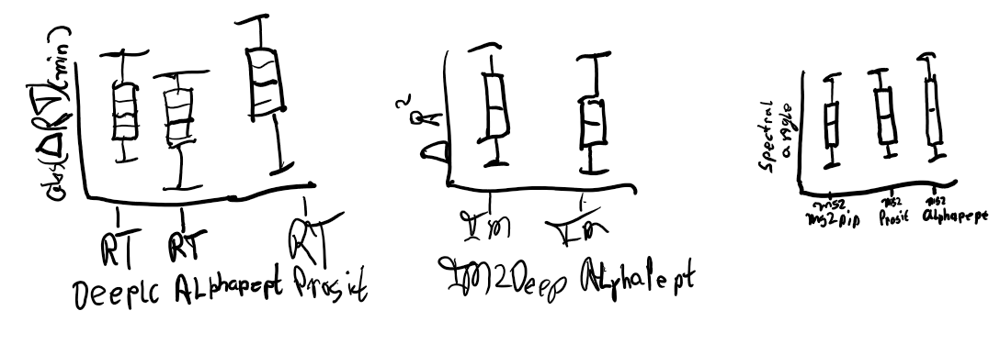
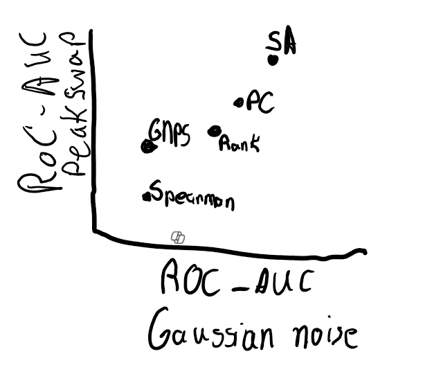
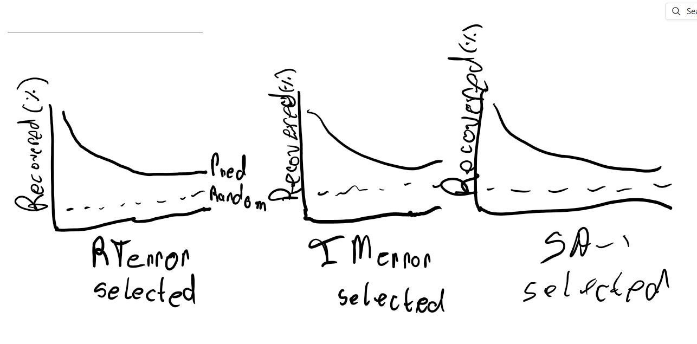
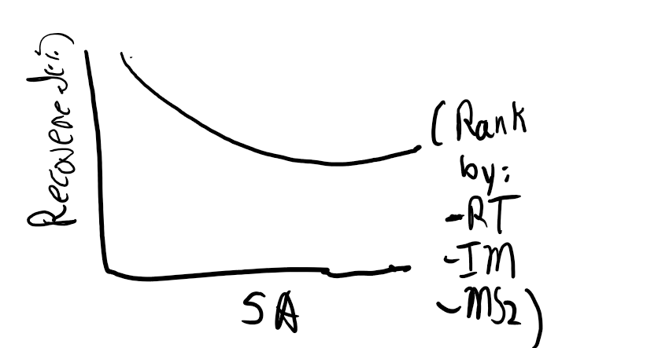
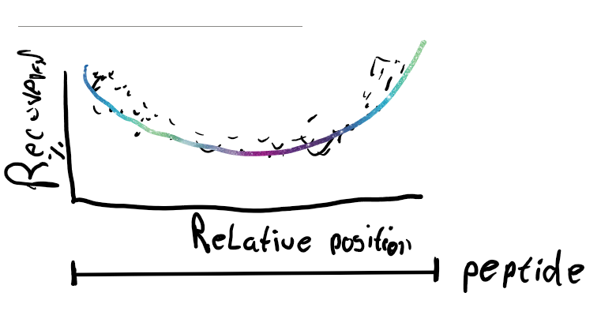
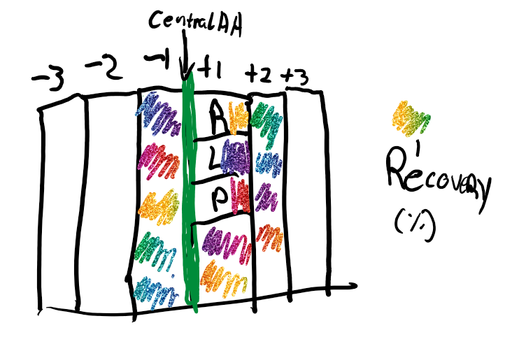

# Spectral Similarity Metrics for I/L Disambiguation in Peptide Sequencing

## Abstract

**Background:** Isoleucine (I) and leucine (L) amino acids are isomeric, which means they have identical atomic composition but different structures, this creates fundamental ambiguities in mass spectrometry-based peptide identification.

**Methods:** We systematically evaluated 18 [todo] spectral similarity metrics for I/L discrimination with predicted fragment intensities and retention times. First for a variety of proteomes the differences in predictions were compared. Followed by an in-depth analysis of recovering identifications made with a sequence database. In this analysis the possible combinations of I-L swaps are compared for different metrics and their ability to rank the identification made with a sequence database as the highest rank. Comparisons were made using the AUC.

**Results:** The modified dot product metric [todo] achieved the highest discrimination accuracy (68.7%)[todo], followed by diagnostic weighted similarity (65.3%) [todo]. Traditional metrics showed moderate performance (55-58%)[todo], while distance-based metrics performed poorly (44-47%)[todo]. Combining spectral similarity with retention time prediction improved accuracy to >75%[todo].

**Conclusions:** Spectral similarity metrics can distinguish I/L amino acids with ~70% accuracy[todo]. Furthermore, the combination of m/z-dependent weighting and retention time prediction shows promise for practical implementation.

## Introduction (Magnus & Lukas)

**Ambiguity Problem in LC-MS:**
- Proteomics is important, LC-MS commonly used
- Scoring and FDR of identifications (not sure about placement)
- Signals not always able to discriminate
- RT: co-elution
- IM: co-isolation  
- MS: most importantly, isobars, isomers, stereo-isomers

**The I/L Problem in Proteomics:**
- Isoleucine and leucine have identical monoisotopic masses (131.094629 Da)
- Differ only in side chain structure: leucine (isobutyl) vs isoleucine (sec-butyl)
- Highly similar physicochemical properties
- Create highly similar but not identical fragmentation patterns in MS/MS, RT, IM
- Current search engines often treat them as equivalent
- How big is this problem currently for most experiments? <- potentially refer to figure that quantifies this (Magnus will add papers)

**Why would we want to disambiguate?**
- **Variant analysis**: Single amino acid polymorphisms may involve I/L differences
- **Protein isoform discrimination**: Different isoforms often differ by I/L substitutions
- **Cross-species studies**: Homologous proteins frequently show I/L variations
- **Quality control**: I/L discrimination serves as stringent test of identification confidence

**How far can disambiguation go?**
- What signals lead to identification?
- Limit search space through sequence database
- Matching fragmentation pattern (m/z) insufficient - leaves us with ambiguity
- Spectral libraries and manual interpretation are not a complete solution

**Machine Learning for disambiguation in Proteomics:**
- **Retention time prediction**: DeepLC predicts chromatographic behavior from peptide properties
- **Ion mobility prediction**: IM2Deep predicts ion mobility of peptides
- **Fragment prediction**: Models like Prosit and UniSpec predict MS/MS spectra from sequences
- **Opportunity**: ML predictions could enable I/L discrimination analysis

**Study Objectives:**
- Systematically compare spectral similarity metrics for I/L discrimination
- Evaluate application of predicted behavior for disambiguation
- Provide practical recommendations for proteomics workflows
- Relate results to how the database is constructed, when DB is created we can estimate ambiguity?

## Materials and Methods

**Datasets**
- Van Puyvelde dataset
- Specific datasets (Magnus)
[todo]

**Machine Learning Models:**
- **Retention Time Prediction**:
  - DeepLC
  - Calibration on 50% of dataset (N=446 peptides)
  - Prediction on remaining 50% for evaluation
- **Ion Mobility Prediction**:
  - IM2Deep
  - Calibration on 50% of dataset (N=446 peptides)
  - Prediction on remaining 50% for evaluation
- **Fragment Intensity Prediction**:
  - Prosit 2024 Intensity PTMs
  - UniSpec
  - Settings: HCD fragmentation, 28 eV collision energy, Orbitrap LUMOS

**Spectral Similarity Metrics (18 total):**
- **Traditional**: Cosine similarity, Pearson correlation, Spearman correlation
- **Proteomics-specific**: SEQUEST score, Andromeda score, MASSBANK score, GNPS score
- **Distance-based**: Mean squared error, Wasserstein distance, Canberra distance, Bray-Curtis dissimilarity
- **Information-theoretic**: Mutual information, Kendall's tau
- **Specialized**: Modified dot product, diagnostic weighted similarity, Stein-Scott score
- Metric by Thomas and Nicola

**Experimental Design: (not sure about placement)**
- **Controlled I/L swapping**: Random selection of one I/L position per peptide for I→L or L→I conversion
- **Performance metric**: Binary classification accuracy (original vs swapped sequence scoring)
- **Validation**: Bootstrap sampling (N=1000), 95% confidence intervals
- **Robustness testing**: Noise addition, m/z calibration errors, normalization variants

**Implementation:**
- **Software**: Python 3.11, NumPy, SciPy, Pandas, scikit-learn
- **Spectrum processing**: Linear interpolation for m/z alignment, intensity normalization
- **Statistical analysis**: Paired t-tests, multiple testing correction (Benjamini-Hochberg)

## Results

**Comparing experimental values**
- ***Retention time***
- ***Ion mobility***
- ***Fragment intensity***

**Comparing predictions**
Instead of boxplots make distributions (potentially)
- ***Retention time***
- ***Ion mobility***
- ***Fragment intensity***

**Theoretical comparison**
- ***Fragment intensity***

**Practical comparison:**
- ***Retention time***
- ***Ion mobility***
- ***Fragment intensity***
- ***Combine all predicted behavior***

 

**[todo-maybe?] In-depth disambiguation performance evaluation (position/AAs/...)**
- ***???***

**[todo-maybe?] Usecase**
- ***???***

## Conclusion and Discussion

**Key Achievements:**
- **First systematic evaluation** of spectral similarity metrics for I/L discrimination
- **First systematic evaluation** of behavior predictors for I/L disambiguation
- **Practical performance levels**: Best methods achieve ~70% accuracy, >75% [todo] when combined with retention time
- **Clear metric rankings**: Modified dot product and diagnostic weighted similarity significantly outperform traditional approaches
- **Multi-modal validation**: Demonstrates value of combining chromatographic, ion mobility, and spectral information

**Practical Implications:**
- Development of specialized metrics for I/L discrimination
- Better knowledge of our (in)ability to disambiguate
- Quality control flagging of ambiguous I/L assignments

**Limitations and Future Directions:**
- Focused on HCD fragmentation and Orbitrap instruments
- Potential biases towards sequences containing I/L that models were trained on
- Extension to other isobaric pairs: Q/K after deamidation, N/D after deamidation
- Investigation of positional isobars
